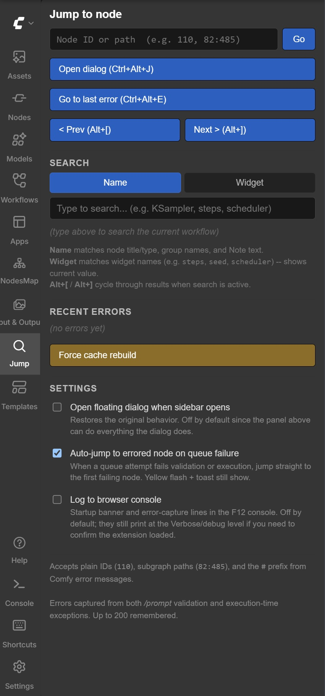
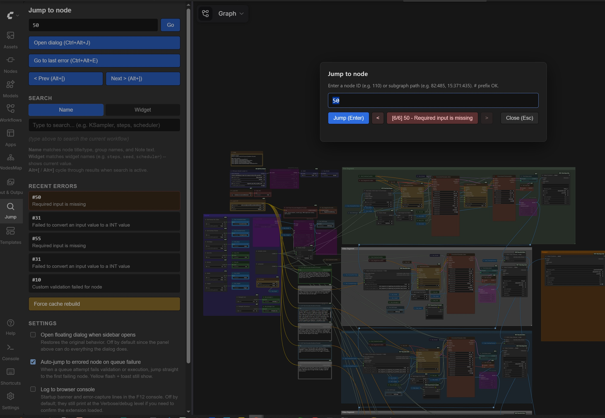
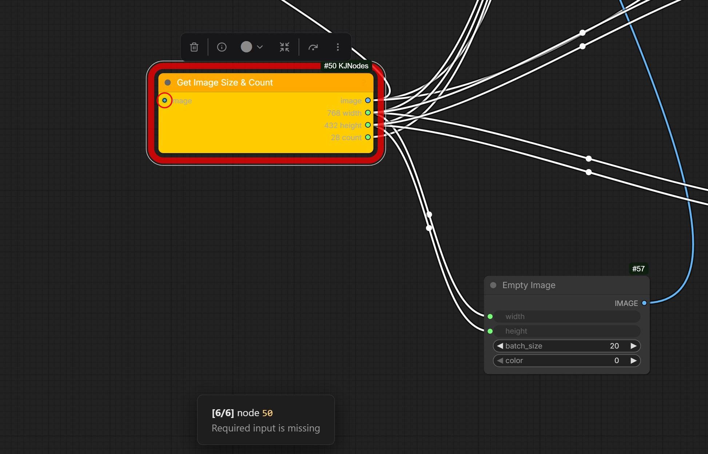

# ComfyUI-JumpToNode

A small frontend extension that adds two things ComfyUI's UI doesn't currently
have natively: **jump to the node that just errored, or jump to a node by its numeric ID** (including subgraph paths
like `82:485`), and **cycle through the most recent nodes the backend has
errored on**. Designed to save the canvas-zooming time when an error message
gives you a node ID and you can't tell where it is on a big workflow.

## Honest disclaimer

This was vibecoded with Claude Opus/Fable (Anthropic) iteratively over many sessions while
I was using it for my own workflows. I'm not a programmer and I'm not going to
be heavily maintaining this. 

## What it does

- **Floating dialog** -- `Ctrl+Alt+J` opens a search dialog. Type a node ID
  (`110`), a subgraph path (`82:485` or `15:371:435`), or paste the `#` form
  from a Comfy error message (`#82:485`). Enter jumps to it, the canvas
  centers on the node, and it flashes yellow briefly.
- **Cycle through error history** -- `Alt+]` next error, `Alt+[` previous
  error. Up to 200 entries. When a queue attempt fails, every node ID in the
  response is captured (not just the first), so for those validation errors
  that list 12 failing samplers, you can walk through every one.
- **Jump to most recent error** -- `Ctrl+Alt+E`.
- **Left sidebar tab** (magnifying glass icon, near the bottom under
  Templates). Click it for a panel with:
    - Inline ID input -- jump by ID/path right from the sidebar, no dialog
    - "Go to last error" button
    - Prev/Next cycle buttons
    - **Search the workflow** by node name, group name, or widget name.
      Name mode matches node titles/types, group titles (including groups
      buried inside subgraphs -- jumping to one navigates into the subgraph
      and zooms to fit the group), and Note text. Widget mode matches widget
      names across every node and shows the current value, so you can see
      every `seed` or `steps` in a heavily subgraphed workflow at once.
    - Recent errors list (last 5, clickable)
    - Force Cache Rebuild button (see below)
    - Settings toggles (described below)
- **Canvas right-click menu** has all of the above as menu items too.
- **Command palette** ditto. Search for "Jump".

Sidebar panel with search, error history, and settings:



Floating dialog with error cycling, recent errors list in the sidebar:



Jumping flashes the target node and shows a toast:



## Force Cache Rebuild

A workaround button for [ComfyUI core issue #13010](https://github.com/comfyanonymous/ComfyUI/issues/13010)
-- the "Required input is missing: image" failure on `INPUT_IS_LIST` nodes
inside subgraphs after editing a loaded workflow. Bumps a safe numeric widget
on every top-level node, then reverts it, which invalidates the CacheProvider's
stale references. Run it right before queueing if you hit that error.

If the in-editor version doesn't resolve it, there's a JSON-level equivalent
floating around in other repair packs.

## Settings (in the sidebar panel)

Both off by default. Stored in `localStorage`, survive reloads.

- **Open floating dialog when sidebar opens** -- if you prefer the dialog
  popping every time you click the sidebar icon (the v6.1 behavior), tick this
  on. Off by default because the inline ID input in the panel does everything
  the dialog does.
- **Auto-jump to errored node on queue failure** -- when ComfyUI rejects a
  queue attempt (validation or execution), automatically jumps to the first
  failing node and flashes it yellow. Off by default since some debugging
  workflows you don't want the canvas yanking on every failed queue.
- **Log to browser console** -- the startup banner and per-error capture
  lines. Off by default so the extension stays quiet in the F12 console;
  they still print at the debug level (set the console filter to Verbose to
  see them) if you need to confirm it loaded.

## Install

Clone or download into `custom_nodes/`:

```
ComfyUI/
  custom_nodes/
    ComfyUI-JumpToNode/
      __init__.py
      web/
        jump_to_node.js
```

The `jump_to_node.js` file must be inside the `web/` subfolder, not the
pack root -- the `WEB_DIRECTORY` line in `__init__.py` points there and
ComfyUI won't serve the script from anywhere else.

Restart ComfyUI. Hard-reload the browser tab (Ctrl+F5).

To confirm it loaded: the magnifying-glass tab appears in the left sidebar,
or set the F12 console log level to Verbose and look for a line starting
with `[JumpToNode] ready (v7.1)`. (The banner is debug-level by default;
there's a settings toggle if you want it as a normal log line.)

No Python dependencies -- `__init__.py` registers zero nodes and imports
nothing. Nothing is added to or changed in your ComfyUI environment.

## Hotkeys reference

| Combo            | Action                                |
|------------------|---------------------------------------|
| `Ctrl+Alt+J`     | Open the floating dialog              |
| `Ctrl+Alt+E`     | Jump to the most recent error node    |
| `Alt+]`          | Cycle to next error (or next search result) |
| `Alt+[`          | Cycle to previous error (or previous search result) |

All hotkeys are bound on the capture phase of `keydown`, so they fire before
any other extension's listener and don't collide -- you don't need to delete
anything else's binding to make these work.

## Compatibility

Built and tested on the ComfyUI frontend that was current April-May 2026.
Uses the modern `getCanvasMenuItems` hook (not the deprecated
`getCanvasMenuOptions` prototype patch), so there's no deprecation noise in
the console.

The error capture wraps `api.queuePrompt`, `api`'s `execution_error` event,
and (defensively) `window.fetch` -- whichever path your Comfy build sends
errors through, at least one of them should fire.

If you're on a much older Comfy build that doesn't have
`extensionManager.registerSidebarTab`, the sidebar tab just won't appear --
the hotkeys, command palette entries, and right-click menu still work.

## License

MIT. Use, fork, modify freely. No warranty, expressed or implied. As-is.

## Changelog

- v7.1 -- Name search now actually covers group titles, including groups
  inside subgraphs (jumps into the subgraph and zooms to fit the group).
  Console output is quiet by default; new settings toggle to turn it on.
- v7.0 -- migrated right-click menu to `getCanvasMenuItems`, settings
  toggles, auto-jump option, inline sidebar ID input.
- v6.x -- in-graph search (Name/Widget), context-aware cycle hotkeys.
- v5 -- capture `missing_node_type` flat-error responses.
- v4 -- recent-errors list, Force Cache Rebuild.
- v3 -- sidebar tab.
- v2 -- error history with cycle navigation.
- v1 -- dialog, hotkeys, canvas menu, command palette, subgraph paths.
